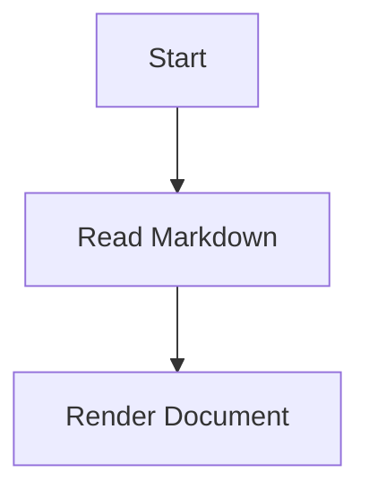

MD File Reader
A browser-based Markdown document viewer that turns plain .md files into a structured, searchable, and print-friendly reading experience.
The project exists to make Markdown documents easier to read without requiring a dedicated editor, build process, or backend service. It provides a document-oriented interface with navigation, search, filtering, tables, Mermaid diagrams, responsive layouts, and printing support.
Why This Web App Exists
Raw Markdown is useful for authoring, but it is not always comfortable for reading long documents. Large Markdown files can contain many sections, tables, diagrams, and metadata that are difficult to navigate in a basic text editor or browser preview.
MD File Reader provides:
- A focused reading interface for Markdown files
- Automatic navigation from document headings
- Search and section filtering
- Better handling of large tables
- Inline Mermaid diagram rendering
- Responsive desktop and mobile layouts
- Print-ready document output
- No backend or server-side processing required
The application runs entirely in the browser.
Getting Started
The viewer is implemented in index.html.
Default Markdown Source
On page load, the viewer attempts to fetch:
your_md_file.md
To use a default document, place a Markdown file with that name beside index.html.
The source path can be changed in the JavaScript section:
const sourcePath = 'your_md_file.md';
Opening a Local File
If the default file cannot be fetched, such as when index.html is opened directly using a local file:// URL, the application displays the manual file picker.
Users can also open the Open a Markdown file section at any time and choose a .md or .markdown file. The selected filename is displayed while the document is being rendered.
Features
Document Loading and Source
- Fetches your_md_file.md automatically when the page loads.
- Falls back to a manual file picker if fetching fails.
- Supports .md and .markdown files.
- Provides an expandable Open a Markdown file picker.
- Uses a standard file input without requiring drag and drop.
- Displays the selected filename.
- Shows a loading spinner while the document is rendered.
- Displays the current source filename in the document header.
- Shows a fallback message when no document can be loaded.
Markdown Rendering
- Renders Markdown using marked.js (https://marked.js.org/).
- Enables GitHub-Flavored Markdown support.
- Supports headings, paragraphs, lists, links, blockquotes, code blocks, tables, and inline code.
- Parses a YAML-like front matter block at the beginning of the document.
- Displays front matter as a dedicated key/value table.
- Supports simple key: value front matter entries.
- Formats JSON-like front matter values into readable key/value text.
- Intercepts fenced Mermaid code blocks.
- Renders Mermaid blocks as diagrams instead of displaying them as ordinary code.
Example Mermaid block:

Table of Contents and Navigation
- Automatically generates a sidebar table of contents.
- Builds the table of contents from h2, h3, and h4 headings.
- Generates unique slugified anchor IDs for headings.
- Adds numeric suffixes when headings produce duplicate slugs.
- Highlights the currently active section while scrolling.
- Includes a reading-progress bar tied to scroll depth.
- Keeps the sidebar sticky on desktop.
- Provides a collapsible contents drawer on mobile.
- Closes the mobile drawer after selecting a table-of-contents link.
Search
- Provides a global document search box.
- Searches across rendered document content.
- Hides top-level content blocks that do not match the search query.
- Hides table-of-contents links for non-matching sections.
- Displays a No matching sections message when there are no results.
- Updates results as the user types.
Section Filter
The Filter dialog provides a hierarchical section-selection interface.
- Displays sections as an h2 → h3 → h4 checkbox tree.
- Supports cascading selection from parents to children.
- Selecting a subsection automatically enables its ancestors.
- Deselecting a parent hides its subsections.
- Includes a Select all checkbox.
- Supports an indeterminate state when only some sections are selected.
- Provides separate Save and Cancel actions.
- Hides filtered sections from the document content.
- Hides filtered sections from the table of contents.
- Closes when:
- The close button is clicked
- The Cancel button is clicked
- The modal overlay is clicked
- The Escape key is pressed
Tables
- Wraps rendered tables in horizontally scrollable containers.
- Prevents wide tables from breaking the page layout.
- Automatically paginates tables containing more than 10 rows.
- Provides a search box for each paginated table.
- Supports configurable rows per page:
- 10
- 25
- 50
- 100
- Includes Previous and Next pagination controls.
- Displays the current row range and total number of matching rows.
- Hides rows outside the current page.
- Applies zebra striping to visible rows.
- Recalculates striping after table filtering and pagination.
- Shows a no-results message when a table search has no matching rows.
Mermaid Diagrams
Mermaid diagrams are rendered with a dark screen-oriented theme for normal viewing.
Each diagram includes:
- A bordered and scrollable diagram frame.
- Pan support by dragging.
- Zoom support using the mouse wheel.
- Zoom-in and zoom-out buttons.
- A reset-view button.
- Floating diagram controls.
- A maximum and minimum zoom range.
- Pointer-based dragging support.
- A visual grabbing cursor while dragging.
The diagram theme is changed to a print-friendly light theme when printing.
Printing
The Print button prepares the document before calling window.print().
Before printing, the viewer:
- Opens all collapsed 
 elements.
- Resets Mermaid diagram zoom and pan positions.
- Switches diagrams to a print-friendly theme.
- Applies print-specific styling.
- Unhides paginated table rows.
- Removes interactive controls and screen-only UI.
The dedicated print stylesheet:
- Hides the top bar.
- Hides the sidebar.
- Hides filter controls.
- Hides the draft status badge.
- Hides the source picker.
- Hides the summary card area.
- Forces page breaks before h2 headings.
- Prevents tables, diagrams, and code blocks from splitting where possible.
- Converts the page to a high-contrast light layout.
- Makes wide tables printable.
- Restores all paginated table rows.
- Removes diagram control buttons.
- Adjusts code, table, link, and heading colors for printing.
After printing, the application restores the previous UI state:
- Removes print mode.
- Re-collapses 
 elements that were originally closed.
- Restores the normal dark Mermaid theme.
Responsive Design and Accessibility
The interface adapts to desktop, tablet, and mobile screen sizes.
At viewport widths of 840px or less:
- The layout changes from a two-column grid to a single-column layout.
- The sidebar becomes a collapsible drawer.
- The sidebar opens using the Contents button.
- The search toolbar is condensed.
- Desktop Filter and Print buttons are hidden from the top toolbar.
- Filter and Print actions are available inside the mobile sidebar.
- Document spacing and heading sizes are reduced for smaller screens.
- The sidebar overlays the document instead of taking permanent layout space.
Accessibility-related features include:
- Visible focus outlines using :focus-visible.
- Screen-reader-only labels for search fields.
- Semantic buttons and labels.
- Accessible names for toolbar controls.
- aria-expanded state for the mobile contents drawer.
- aria-modal and labelled dialog structure for the filter modal.
- Keyboard support for closing the filter modal with Escape.
- Reduced-motion support through prefers-reduced-motion.
When reduced motion is enabled:
- Smooth scrolling is disabled.
- CSS transitions are disabled.
- CSS animations are disabled.
Miscellaneous UI
- Header branding identifies the application as MD File Reader.
- The header displays the current source file.
- A Draft without direction · reader view badge identifies the interface as a reading view.
- A summary card area exists as a reserved placeholder for future document statistics.
- The summary cards are currently commented out and unused.
- The interface uses a dark, glass-like visual style with cyan and amber accents.
- The application uses a local background image and a blurred decorative background layer.
External Dependencies
The application loads these browser-side libraries from jsDelivr:

Dependencies:
- marked.js for Markdown parsing
- mermaid.js for diagram rendering
An internet connection is required for these CDN scripts unless they are replaced with locally hosted copies.
Project Structure
.
├── index.html
├── your_md_file.md
├── 1156125.jpg.jpeg
└── background/
    └── background 1.jpeg
The application logic, styling, layout, and markup are currently contained in index.html.
Running the Viewer
Because the viewer uses fetch() to load the default Markdown source, it is best to serve the project through a local HTTP server.
For example, with Python:
python -m http.server 8000
Then open:
http://localhost:8000/
Opening index.html directly from the filesystem is also supported through the manual file picker, but the automatic default-document fetch may fail because of browser security restrictions around local files.
Front Matter Format
The viewer supports a simple YAML-like front matter block:
---
title: Product Requirements Document
author: Documentation Team
status: Draft
version: 1.0
---

# Product Requirements Document

Document content starts here.
The metadata appears in a table above the rendered Markdown content.
Design Goals
The project is designed around the following principles:
- Keep Markdown as the source of truth.
- Make long documents easier to navigate.
- Keep the viewer lightweight and dependency-free apart from CDN libraries.
- Avoid requiring a backend or database.
- Provide useful reading tools without turning the interface into a full editor.
- Make documents usable on both desktop and mobile devices.
- Ensure printed output remains readable and structured.
- Preserve accessibility and keyboard usability where possible.
