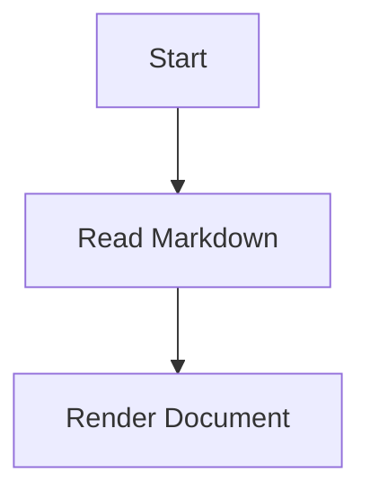

# MD File Reader

MD File Reader is a browser-based Markdown document viewer. It turns plain `.md` files into a structured, searchable, navigable, and print-friendly reading experience.

The project exists because long Markdown files can be difficult to read in a basic text editor or browser preview. This viewer adds document navigation, search, section filtering, table tools, Mermaid diagrams, responsive layouts, and print support without requiring a backend or a build process.

The application runs entirely in the browser and is implemented in `index.html`.

## Getting Started

### Default Markdown Source

When the page loads, the viewer attempts to fetch:

```text
your_md_file.md
```

Place a Markdown file with that name beside `index.html`, or change the source path in the JavaScript section of `index.html`:

```js
const sourcePath = 'your_md_file.md';
```

### Local File Loading

If the default fetch fails, such as when the page is opened directly from a `file://` URL, the viewer displays a manual file picker. Users can select a `.md` or `.markdown` file from the **Open a Markdown file** section.

### Running Through a Local Server

The default source fetch works best when the project is served over HTTP. For example:

```bash
python -m http.server 8000
```

Open `http://localhost:8000/` in a browser.

Opening `index.html` directly is still supported through the manual file picker, but browsers may block the automatic fetch of `your_md_file.md` for security reasons.

## Features

### Document Loading and Source

- Fetches `your_md_file.md` automatically when the page loads.
- Falls back to a manual file picker if fetching fails.
- Supports `.md` and `.markdown` files.
- Provides an expandable **Open a Markdown file** picker.
- Uses a standard file input without requiring drag and drop.
- Displays the selected filename.
- Shows a loading spinner while the document is rendered.
- Displays the current source filename in the document header.
- Shows a fallback message when no document can be loaded.

### Markdown Rendering

- Renders Markdown with [`marked.js`](https://marked.js.org/).
- Enables GitHub-Flavored Markdown support.
- Supports headings, paragraphs, lists, links, blockquotes, code blocks, tables, and inline code.
- Parses a YAML-like front matter block at the beginning of the document.
- Displays front matter as a dedicated key/value table above the document body.
- Intercepts fenced Mermaid code blocks and renders them as diagrams.

Example Mermaid block:

````markdown

````

### Table of Contents and Navigation

- Automatically generates a sidebar table of contents.
- Builds the table of contents from `h2`, `h3`, and `h4` headings.
- Generates unique slugified anchor IDs for headings.
- Adds numeric suffixes when headings produce duplicate slugs.
- Highlights the active section while scrolling.
- Includes a reading-progress bar tied to scroll depth.
- Keeps the sidebar sticky on desktop.
- Provides a collapsible contents drawer on mobile.
- Closes the mobile drawer after a table-of-contents link is selected.

### Search

- Provides a global document search box.
- Searches across rendered document content.
- Hides top-level content blocks that do not match the query.
- Hides non-matching table-of-contents links.
- Displays a **No matching sections** empty state when there are no results.
- Updates results as the user types.

### Section Filter

The **Filter** dialog provides a hierarchical section-selection interface.

- Displays sections as an `h2` to `h3` to `h4` checkbox tree.
- Checking a parent selects its children.
- Selecting a subsection automatically enables its ancestors.
- Supports a **Select all** checkbox.
- Shows an indeterminate state when only some sections are selected.
- Provides separate **Save** and **Cancel** actions.
- Hides filtered sections from the document content and table of contents.
- Closes from the close button, Cancel button, overlay click, or `Escape` key.

### Tables

- Wraps tables in horizontally scrollable containers.
- Prevents wide tables from breaking the page layout.
- Automatically paginates tables containing more than 10 rows.
- Provides a search box for each paginated table.
- Supports 10, 25, 50, or 100 rows per page.
- Includes Previous and Next pagination controls.
- Displays the current row range and matching-row count.
- Hides rows outside the current page.
- Applies zebra striping to visible rows.
- Recalculates striping after filtering and pagination.
- Displays a no-results message when a table search has no matches.

### Mermaid Diagrams

Mermaid diagrams use a dark screen theme during normal viewing.

Each diagram supports:

- Pan by dragging.
- Zoom using the mouse wheel.
- Zoom-in and zoom-out buttons.
- A reset-view button.
- A bordered, scrollable diagram frame.
- Floating diagram controls.
- Pointer-based dragging.
- A grabbing cursor while dragging.

The diagram theme changes to a print-friendly light theme when the document is printed.

### Printing

The **Print** button prepares the document before calling `window.print()`.

Before printing, the viewer:

- Opens all collapsed `<details>` elements.
- Resets Mermaid diagram zoom and pan positions.
- Switches diagrams to a print-friendly theme.
- Hides interactive controls and screen-only UI.
- Unhides paginated table rows.
- Applies dedicated print styling.

The print stylesheet:

- Hides the top bar, sidebar, filter controls, draft badge, source picker, and summary area.
- Forces page breaks before `h2` headings.
- Prevents tables, diagrams, and code blocks from splitting where possible.
- Converts the document to a high-contrast light layout.
- Makes wide tables printable.
- Removes diagram control buttons.
- Adjusts heading, link, code, table, and background colors for print.

After printing, the viewer restores the normal UI state, including re-collapsing `<details>` elements that were previously closed and restoring the screen Mermaid theme.

### Responsive Design and Accessibility

At viewport widths of `840px` or less:

- The two-column layout changes to a single-column layout.
- The sidebar becomes a collapsible drawer.
- The drawer opens through the **Contents** button.
- The toolbar is condensed for smaller screens.
- Desktop Filter and Print buttons are replaced by sidebar action buttons.
- Document spacing and heading sizes are reduced for mobile screens.
- The sidebar overlays the document instead of permanently occupying layout space.

Accessibility features include:

- Visible focus outlines using `:focus-visible`.
- Screen-reader-only labels for search inputs.
- Semantic buttons, labels, navigation, and dialog structure.
- Accessible names for toolbar controls.
- `aria-expanded` state for the mobile contents drawer.
- `aria-modal` and labelled dialog markup for the filter modal.
- Keyboard support for closing the filter modal with `Escape`.
- Reduced-motion support through `prefers-reduced-motion`.

When reduced motion is enabled, smooth scrolling, CSS transitions, and CSS animations are disabled.

### Miscellaneous UI

- Header branding identifies the application as **MD File Reader**.
- The current source filename appears in the header.
- The **Draft without direction, reader view** badge identifies the interface as a reading view.
- A summary card area is reserved for future document statistics.
- The summary cards are currently commented out and unused.
- The interface uses a dark visual style with cyan and amber accents.
- Local background images provide the decorative background treatment.

## Front Matter Format

The viewer supports a simple YAML-like front matter block at the start of a Markdown file:

```markdown
---
title: Product Requirements Document
author: Documentation Team
status: Draft
version: 1.0
---

# Product Requirements Document

Document content starts here.
```

The metadata is rendered as a table above the Markdown content.

## External Dependencies

The application loads its browser-side dependencies from jsDelivr:

```html
<script src="https://cdn.jsdelivr.net/npm/marked/marked.min.js"></script>
<script src="https://cdn.jsdelivr.net/npm/mermaid@11/dist/mermaid.min.js"></script>
```

Dependencies:

- `marked.js` for Markdown parsing.
- `mermaid.js` for diagram rendering.

An internet connection is required for these CDN scripts unless they are replaced with locally hosted copies.

## Project Structure

```text
.
├── index.html
├── README.md
├── your_md_file.md
├── 1156125.jpg.jpeg
└── background/
    └── background 1.jpeg
```

The application layout, styling, markup, and JavaScript logic are currently contained in `index.html`.

## Design Goals

The viewer is designed to:

- Keep Markdown as the source of truth.
- Make long documents easier to navigate.
- Keep the viewer lightweight.
- Avoid requiring a backend or database.
- Provide reading tools without becoming a full Markdown editor.
- Work on desktop and mobile screens.
- Produce readable printed output.
- Preserve keyboard and accessibility support.
