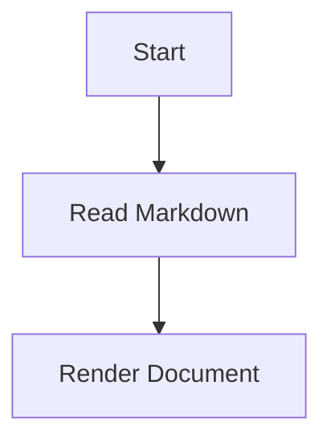

# MD File Reader

MD File Reader is a browser-based Markdown document viewer. It turns plain `.md` files into a structured, searchable, navigable, and print-friendly reading experience.

The project exists because long Markdown files can be difficult to read in a basic text editor or browser preview. This viewer adds document navigation, search, section filtering, table tools, Mermaid diagrams, responsive layouts, and print support without requiring a backend or a build process.

The application runs entirely in the browser and is implemented in `index.html`.

## Getting Started

### Default Markdown Source

When the page loads, the viewer attempts to fetch:

```text
your_md_file.md
```

Place a Markdown file with that name beside `index.html`, or change the source path in the JavaScript section of `index.html`:

```js
const sourcePath = 'your_md_file.md';
```

### Local File Loading

If the default fetch fails, such as when the page is opened directly from a `file://` URL, the viewer displays a manual file picker. Users can select a `.md` or `.markdown` file from the **Open a Markdown file** section.

### Running Through a Local Server

The default source fetch works best when the project is served over HTTP. For example:

```bash
python -m http.server 8000
```

Open `http://localhost:8000/` in a browser.

Opening `index.html` directly is still supported through the manual file picker, but browsers may block the automatic fetch of `your_md_file.md` for security reasons.

## Features

### Document Loading and Source

- Fetches `your_md_file.md` automatically when the page loads.
- Falls back to a manual file picker if fetching fails.
- Supports `.md` and `.markdown` files.
- Provides an expandable **Open a Markdown file** picker.
- Uses a standard file input without requiring drag and drop.
- Displays the selected filename.
- Shows a loading spinner while the document is rendered.
- Displays the current source filename in the document header.
- Shows a fallback message when no document can be loaded.

### Markdown Rendering

- Renders Markdown with [`marked.js`](https://marked.js.org/).
- Enables GitHub-Flavored Markdown support.
- Supports headings, paragraphs, lists, links, blockquotes, code blocks, tables, and inline code.
- Parses a YAML-like front matter block at the beginning of the document.
- Displays front matter as a dedicated key/value table above the document body.
- Intercepts fenced Mermaid code blocks and renders them as diagrams.
- Draws fenced `swimlane` code blocks as swimlane activity diagrams (see *Swimlane Activity Diagrams*).

Example Mermaid block:

````markdown

```mermaid
flowchart TD
    A[Start] --> B[Read Markdown]
    B --> C[Render Document]
```
````

### Table of Contents and Navigation

- Automatically generates a sidebar table of contents.
- Builds the table of contents from `h2`, `h3`, and `h4` headings.
- Generates unique slugified anchor IDs for headings.
- Adds numeric suffixes when headings produce duplicate slugs.
- Highlights the active section while scrolling.
- Includes a reading-progress bar tied to scroll depth.
- Keeps the sidebar sticky on desktop.
- Provides a collapsible contents drawer on mobile.
- Closes the mobile drawer after a table-of-contents link is selected.

### Search

- Provides a global document search box.
- Searches across rendered document content.
- Hides top-level content blocks that do not match the query.
- Hides non-matching table-of-contents links.
- Displays a **No matching sections** empty state when there are no results.
- Updates results as the user types.

### Section Filter

The **Filter** dialog provides a hierarchical section-selection interface.

- Displays sections as an `h2` to `h3` to `h4` checkbox tree.
- Checking a parent selects its children.
- Selecting a subsection automatically enables its ancestors.
- Supports a **Select all** checkbox.
- Shows an indeterminate state when only some sections are selected.
- Provides separate **Save** and **Cancel** actions.
- Hides filtered sections from the document content and table of contents.
- Closes from the close button, Cancel button, overlay click, or `Escape` key.

### Tables

- Wraps tables in horizontally scrollable containers.
- Prevents wide tables from breaking the page layout.
- Automatically paginates tables containing more than 10 rows.
- Provides a search box for each paginated table.
- Supports 10, 25, 50, or 100 rows per page.
- Includes Previous and Next pagination controls.
- Displays the current row range and matching-row count.
- Hides rows outside the current page.
- Applies zebra striping to visible rows.
- Recalculates striping after filtering and pagination.
- Displays a no-results message when a table search has no matches.

### Mermaid Diagrams

Mermaid diagrams use a dark screen theme during normal viewing.

Each diagram supports:

- Pan by dragging.
- Zoom using the mouse wheel.
- Zoom-in and zoom-out buttons.
- A reset-view button.
- A bordered, scrollable diagram frame.
- Floating diagram controls.
- Pointer-based dragging.
- A grabbing cursor while dragging.

The diagram theme changes to a print-friendly light theme when the document is printed.

### Swimlane Activity Diagrams

A fenced `swimlane` block draws an activity diagram in the notation the FRS standard asks for. Mermaid has no swimlanes, so the viewer draws these itself. They get the same frame, pan and zoom controls as Mermaid diagrams, and are embedded in the Word exports as images.

````markdown
```swimlane
app: Internship Apps
process: Partner Login

lane Partner
    S([Start])
    Login[/Partner Login/]
    Dash[Go To Dashboard]
    Jobs[Show the Application Job]
    E([End])

lane System
    Check{Login Check?}
    Ok[Success Login]

S --> Login --> Check
Check -- Yes --> Ok --> Dash --> Jobs --> E
Check -- No --> Login
```
````

The block has three parts:

- `app:` is the application title, written upright along the left edge. `process:` is the process name, shown in the top row above the lane names.
- Each `lane <name>` line opens a lane, from left to right. The nodes written under it belong to that lane: an id, then a shape.
- The flows come last: `A --> B`, or `A -- Yes --> B` out of a decision. Flows can be chained, as in `A --> B --> C`.

| Shape | Written as | Meaning |
|-------|------------|---------|
| Rounded | `S([Start])`, `E([End])` | Start and end of the process |
| Rectangle | `A[text]` | Activity |
| Parallelogram | `B[/text/]` | Input or output |
| Diamond | `C{text?}` | Decision |

Text may be quoted, and `<br/>` forces a line break; long text wraps by itself. A line that starts with `%%` is a comment.

The notation is checked before the diagram is drawn:

- There is exactly one `Start` and at least one `End`, and a rounded node reads `Start` or `End` and nothing else.
- A decision has exactly two flows leaving it, labelled `Yes` and `No`.
- Every other node has exactly one flow leaving it, without a label. No flow leaves `End` or enters `Start`.
- Every node is reachable from `Start`, and every path reaches `End`.

A block that breaks one of these rules is shown as its source text, with the reason in the banner at the top of the document, like a Mermaid block with a syntax error.

Nodes and flows are placed automatically. Each step takes a row in the column of its lane, and a lane gets a second column where a decision branches inside it. Flows run on separate tracks between the nodes, so a flow never runs over a node, a label or another flow. Flows that end at the same node may merge, which is marked with a dot, and a flow that has to cross another one hops over it. If a diagram comes out crowded, change the order of the lanes or split the process into two diagrams.

### Printing

The **Print** button prepares the document before calling `window.print()`.

Before printing, the viewer:

- Opens all collapsed `<details>` elements.
- Resets Mermaid diagram zoom and pan positions.
- Switches diagrams to a print-friendly theme.
- Hides interactive controls and screen-only UI.
- Unhides paginated table rows.
- Applies dedicated print styling.

The print stylesheet:

- Hides the top bar, sidebar, filter controls, draft badge, source picker, and summary area.
- Forces page breaks before `h2` headings.
- Prevents tables, diagrams, and code blocks from splitting where possible.
- Converts the document to a high-contrast light layout.
- Makes wide tables printable.
- Removes diagram control buttons.
- Adjusts heading, link, code, table, and background colors for print.

After printing, the viewer restores the normal UI state, including re-collapsing `<details>` elements that were previously closed and restoring the screen Mermaid theme.

### Templates

The **Templates** menu next to the search box lists the files in the `template/` folder and downloads them one by one, or all together as `templates.zip`.

The list is defined in the JavaScript section of `index.html`, because a page without a backend cannot read a folder listing:

```js
const templatesPath = 'template/';
const templateFiles = [
  { file: 'template-internal-it.md', label: 'Internal IT document' },
  { file: 'template-frs.md', label: 'FRS content' },
  { file: 'konversi-internal-ke-frs.md', label: 'Internal IT to FRS conversion prompt' }
];
```

Add an entry to `templateFiles` when a file is added to the folder. The FRS and Scoping and Timeline Word templates are deliberately not in this list or in the folder; they are supplied by the person exporting.

### Word Export

The **Print** menu has four entries: **Print / save as PDF** (the print flow above), **Export Word (.docx)**, **Make FRS Document (.docx)** and **Make Scoping and Timeline Document (.docx)**.

Export Word turns the document that is currently open into a plain Word file. It works for any Markdown document and uses no template:

- Headings become real Word headings (Heading 1 to 6), so the navigation pane and a table of contents work.
- Front matter becomes a two-column table at the top.
- Tables get a shaded header row that repeats on each page.
- Code blocks are set in a monospace font on a light background.
- Mermaid diagrams are rendered with the print theme and embedded as PNG images, scaled to fit the page. Swimlane diagrams are embedded the same way.
- The page is A4 portrait. A document that contains a table with seven or more columns is laid out landscape instead.

### Make FRS Document

Make FRS Document takes the document that is currently open and places it into the FRS Word template. The template is not shipped with the viewer: the dialog asks for the `.docx` file and keeps it for the rest of the session.

- Sections `1.1 OBJECTIVES` to `2.4 INTERFACE REQUIREMENT` are replaced with the Markdown content.
- Everything else in the Word template (cover, document information, revision history, reviewer tables, headers, footers, sections 2.5 to 4) is left as it is.
- The title placeholder (`<Judul>`, `[Judul]`) on the cover and in the page header is filled from the front matter `title`, or from the document's `#` heading when there is no front matter title. `[num]` on the cover is filled from `frs_number`.
- The date placeholder (`<DateNow>`, or `xx/xx/xxxx` in the page header) is filled with the date of the export, as `dd/mm/yyyy`.
- Each `2.1.N` block becomes one copy of the template's page table (Detail Information, Page Detail, Screen Layout, Fields Detail), starting on a new page. The table gets the same indent and total width as the other tables, with its columns scaled to fit.
- Markdown tables reuse the look of the template's Scope table, placed like the Terminology table: the same indent from the left margin and the same total width.
- Tables in `1.7 TERMINOLOGY` are the exception: they use the Terminology table of the Scoping and Timeline template (plain borders, indented, bold centred header). The FRS template has no such table, so the viewer carries a copy of that layout; a template that has its own table under `TERMINOLOGY` supplies the layout itself.
- Mermaid diagrams are rendered with the print theme and embedded as PNG images.
- Swimlane diagrams are embedded as black-on-white PNG images. `1.4 WORKFLOW` is expected to use them: the dialog points out a Mermaid diagram in that section, and a swimlane that breaks the notation.
- Images referenced with `` are embedded when the browser can fetch them.
- A value left empty in the Markdown stays empty in Word. `template-frs.md` leaves Running ID, Application ID, Hierarchy ID - Name and the Screen Layout of each `2.1.N` block empty on purpose: they are filled in by hand in Word.

The open document must follow `template/template-frs.md`. Before exporting, the dialog lists what blocks the export (a missing numbered heading or `2.1.N` sub-heading) and what to check (placeholders such as `{{...}}` that are still unfilled).

Notes:

- The table of contents is left exactly as it is in the template, so its page numbers are the template's and must be corrected in Word. Do not use Word's **Update entire table** on it: most headings in the current template are not real Word headings, so a full update drops them from the table.
- When the page is opened from a `file://` URL, linked images cannot be fetched and are replaced by a marker to insert them manually. This applies to Export Word as well.
- The export looks up the template's headings and its Scope and `2.1.1` tables by their text, so those must stay in the Word template.

### Make Scoping and Timeline Document

Make Scoping and Timeline Document works the same way as Make FRS Document, with the Scoping and Timeline Word template. Chapter 1 of that template is the same as chapter 1 of the FRS, so the same Markdown document serves both exports. Each export asks for its own template and keeps it for the rest of the session.

- Sections `1.1 OBJECTIVES` to `1.7 TERMINOLOGY` are replaced with the Markdown content, exactly as in Make FRS Document.
- The title and the date are filled in the same way. `[num]` on the cover is left as it is, because the number in the Markdown is the FRS number, not the number of this document.
- Everything else in the Word template (cover, document information, revision history, reviewer tables, headers, footers, `2. SCHEDULING` and `3. ADMINISTRATION`) is left as it is, including the section break between chapter 1 and chapter 2.
- Chapter 2 of the Markdown document is ignored. A document that only has chapter 1 can be exported too: only the numbered headings `1.1` to `1.7` are required, and only placeholders inside those sections are reported.

The notes of Make FRS Document apply here as well. The export looks up the headings `INTRODUCTION` to `TERMINOLOGY` and `SCHEDULING`, and the Scope table, by their text, so those must stay in the Word template.

### Responsive Design and Accessibility

At viewport widths of `840px` or less:

- The two-column layout changes to a single-column layout.
- The sidebar becomes a collapsible drawer.
- The drawer opens through the **Contents** button.
- The toolbar is condensed for smaller screens.
- Desktop Filter and Print buttons are replaced by sidebar action buttons.
- Document spacing and heading sizes are reduced for mobile screens.
- The sidebar overlays the document instead of permanently occupying layout space.

Accessibility features include:

- Visible focus outlines using `:focus-visible`.
- Screen-reader-only labels for search inputs.
- Semantic buttons, labels, navigation, and dialog structure.
- Accessible names for toolbar controls.
- `aria-expanded` state for the mobile contents drawer.
- `aria-modal` and labelled dialog markup for the filter modal.
- Keyboard support for closing the filter modal with `Escape`.
- Reduced-motion support through `prefers-reduced-motion`.

When reduced motion is enabled, smooth scrolling, CSS transitions, and CSS animations are disabled.

### Miscellaneous UI

- Header branding identifies the application as **MD File Reader**.
- The current source filename appears in the header.
- The **Draft without direction, reader view** badge identifies the interface as a reading view.
- A summary card area is reserved for future document statistics.
- The summary cards are currently commented out and unused.
- The interface uses a dark visual style with cyan and amber accents.
- Local background images provide the decorative background treatment.

## Front Matter Format

The viewer supports a simple YAML-like front matter block at the start of a Markdown file:

```markdown
---
title: Product Requirements Document
author: Documentation Team
status: Draft
version: 1.0
---

# Product Requirements Document

Document content starts here.
```

The metadata is rendered as a table above the Markdown content.

## External Dependencies

The application loads its browser-side dependencies from jsDelivr:

```html
<script src="https://cdn.jsdelivr.net/npm/marked/marked.min.js"></script>
<script src="https://cdn.jsdelivr.net/npm/mermaid@11/dist/mermaid.min.js"></script>
```

Dependencies:

- `marked.js` for Markdown parsing.
- `mermaid.js` for diagram rendering.
- `JSZip` for reading and writing `.docx` and `.zip` files. It is loaded from jsDelivr the first time **Export Word**, **Make FRS Document**, **Make Scoping and Timeline Document** or **Download all** is used.

An internet connection is required for these CDN scripts unless they are replaced with locally hosted copies.

## Project Structure

```text
.
├── index.html
├── README.md
├── your_md_file.md
├── 1156125.jpg.jpeg
├── background/
│   └── background 1.jpeg
└── template/
    ├── template-internal-it.md
    ├── template-frs.md
    └── konversi-internal-ke-frs.md
```

The application layout, styling, markup, and JavaScript logic are currently contained in `index.html`.

## Design Goals

The viewer is designed to:

- Keep Markdown as the source of truth.
- Make long documents easier to navigate.
- Keep the viewer lightweight.
- Avoid requiring a backend or database.
- Provide reading tools without becoming a full Markdown editor.
- Work on desktop and mobile screens.
- Produce readable printed output.
- Preserve keyboard and accessibility support.
