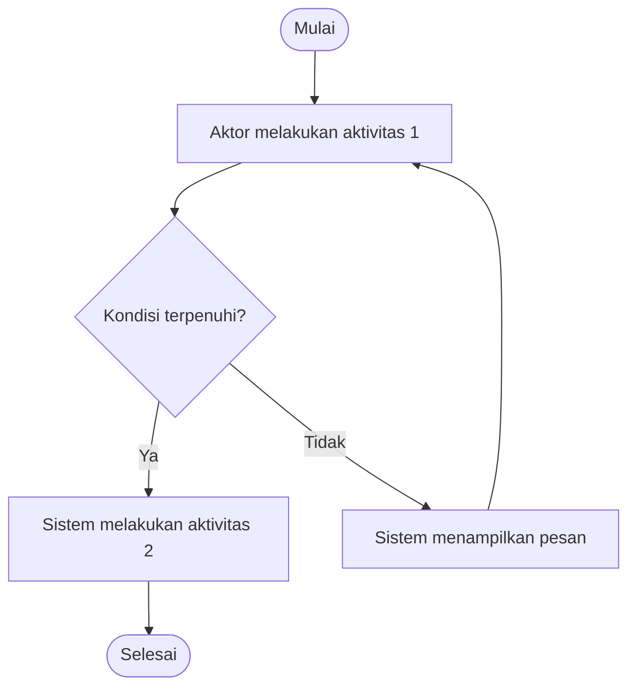

<!--
TEMPLATE ISI FRS (Functional Requirement Statement)
===================================================
Sumber   : "FRS Template.docx", bagian 1.1 OBJECTIVES s/d 2.4 INTERFACE REQUIREMENT.
Pembaca  : user / requester / approver. Tulis dengan bahasa bisnis, bukan bahasa teknis
           (nama tabel, query, dan transaksi DB tempatnya di dokumen internal IT, bukan di sini).
Di luar cakupan file ini: cover, Document Information, Revision History, Document Reviewer,
           2.5 Implementation Schedule, 3. Project Member Team, 4. Administration.

Struktur file ini sengaja dibuat 1:1 dengan template .docx supaya nanti bisa dikonversi otomatis.
Karena itu ada aturan yang perlu dijaga:

1. JANGAN mengubah, menghapus, atau mengganti nomor heading bernomor (1., 1.1 ... 2.4).
   Section yang tidak relevan tetap ditulis, isinya "N/A".
2. JANGAN mengubah nama atau urutan kolom tabel. Menambah baris bebas.
3. Blok "2.1.N" boleh diulang. 1 blok = 1 halaman/komponen untuk 1 role. Nomornya urut: 2.1.1, 2.1.2, ...
   Di dalam tiap blok, 4 sub-heading (Detail Information, Page Detail, Screen Layout, Fields Detail)
   harus ada semua dan urutannya tetap.
4. Ganti semua {{placeholder}}. Cari "{{" untuk memastikan tidak ada yang tertinggal.
   Jangan menulis placeholder dengan kurung siku <...> — itu dibaca sebagai tag HTML dan hilang saat dirender.
5. Elemen yang dipakai hanya: paragraf, bullet/numbered list, tabel, blok mermaid, dan gambar
   . Hindari HTML mentah, tabel di dalam tabel, dan heading tambahan di luar struktur ini.
6. Front matter di atas mengisi judul & header dokumen ("[num] - [Judul]", tanggal). Key-nya jangan diganti.
7. Komentar HTML seperti ini tidak tampil di viewer dan tidak ikut dikonversi.
-->

# {{Nomor FRS}} - {{Judul}}

## 1. INTRODUCTION

### 1.1 OBJECTIVES

<!-- Tujuan yang ingin dicapai, dari sudut pandang user/bisnis. Bisa 1 paragraf atau numbered list. -->

{{Jelaskan tujuan pengembangan.}}

### 1.2 BACKGROUND

<!-- Kondisi saat ini, masalah yang terjadi, dan kenapa perlu ditangani sekarang. -->

{{Jelaskan latar belakang.}}

### 1.3 SCOPE

<!-- Paragraf ringkasan cakupan dulu, baru rincian task di tabel. Yang di luar cakupan sebutkan di paragraf. -->

{{Jelaskan cakupan pekerjaan secara ringkas, termasuk apa yang tidak termasuk.}}

| No | Task | Impact | Modul | Expectation |
|----|------|--------|-------|-------------|
| 1 | {{Task 1}} | {{Impact 1}} | {{Module 1 & Module 2}} | {{Description 1}} |
| 2 | {{Task 2}} | {{Impact 2}} | {{Module}} | {{Description 2}} |

### 1.4 WORKFLOW

<!-- Activity diagram alur bisnis (bukan alur teknis). Ganti isi blok mermaid di bawah.
     Boleh lebih dari 1 diagram; beri 1 kalimat pengantar sebelum tiap diagram.
     Alternatif: gambar, mis.  -->

**Notes:**

1. {{Penjelasan tambahan untuk diagram, bila diperlukan. Jika tidak ada, tulis N/A.}}

### 1.5 ASSUMPTIONS

<!-- Hal yang dianggap benar/tersedia dan menjadi dasar requirement ini. -->

1. {{Asumsi 1}}
2. {{Asumsi 2}}

### 1.6 USER

<!-- Siapa saja yang memakai aplikasi/fitur ini. -->

| No | User / Role | Description |
|----|-------------|-------------|
| 1 | {{Role 1}} | {{Apa yang dilakukan role ini di fitur ini}} |
| 2 | {{Role 2}} | {{...}} |

### 1.7 TERMINOLOGY

<!-- Singkatan dan istilah yang dipakai di dokumen ini. -->

| No | Term | Description |
|----|------|-------------|
| 1 | {{Istilah / singkatan}} | {{Kepanjangan dan artinya}} |
| 2 | {{...}} | {{...}} |

## 2. REQUIREMENT

### 2.1 BUSINESS AND REQUIREMENT FUNCTION

<!-- Ringkasan kebutuhan fungsional secara keseluruhan, sebelum masuk ke rincian per halaman. -->

{{Ringkasan kebutuhan fungsional.}}

<!-- ============ BLOK 2.1.N — ULANGI PER HALAMAN/KOMPONEN PER ROLE ============ -->

#### 2.1.1 {{Application Name}} - {{Role}}

##### Detail Information

| Field | Value |
|-------|-------|
| Running ID | {{...}} |
| Application ID | {{...}} |
| Application Name | {{...}} |
| Hierarchy ID - Name | {{Isi jika ada, jika tidak tulis N/A}} |

##### Page Detail

<!-- New/Existing: tulis persis "New" atau "Existing".
     Navigation: jalur menu menuju halaman, mis. Home > Menu > Sub Menu. -->

| Field | Value |
|-------|-------|
| Page Name | {{...}} |
| Component Name | {{...}} |
| New/Existing | {{New / Existing}} |
| Navigation | {{Menu > Sub Menu > Halaman}} |

##### Screen Layout

<!-- 1 gambar atau lebih. Path relatif terhadap file ini, mis.:
     
     Beri penomoran pada gambar (1, 2, 3, ...) bila ingin dirujuk dari kolom Fields. -->

{{Gambar screen layout}}

##### Fields Detail

<!-- 1 baris per field/tombol/kolom tabel yang tampil di layar.
     Details / Validation : perilaku field, aturan validasi, pesan error, sumber data pilihan.
     Given / Input        : tulis persis "Given" (ditampilkan sistem) atau "Input" (diisi user).
     Mandatory            : tulis persis "Yes" atau "No". -->

| Fields | Details / Validation | Given / Input | Mandatory |
|--------|----------------------|---------------|-----------|
| {{Nama field}} | {{Detail dan validasi}} | {{Given / Input}} | {{Yes / No}} |
| {{Nama field}} | {{Detail dan validasi}} | {{Given / Input}} | {{Yes / No}} |

<!-- ============ AKHIR BLOK 2.1.N — SALIN UNTUK 2.1.2, 2.1.3, ... ============ -->

### 2.2 DATA REQUIREMENT

<!-- Data yang dibutuhkan user terkait proses bisnis: data apa, asalnya dari mana. Jika tidak ada, tulis N/A. -->

{{Jelaskan kebutuhan data secara ringkas.}}

| No | Data | Source | Description |
|----|------|--------|-------------|
| 1 | {{Nama data}} | {{Aplikasi / pihak penyedia data}} | {{Kegunaannya di proses bisnis}} |

### 2.3 REPORTING REQUIREMENT

<!-- Laporan yang dibutuhkan user beserta formatnya. Jika tidak ada, ganti seluruh isi section dengan N/A. -->

{{Jelaskan kebutuhan laporan secara ringkas.}}

| No | Report | Format | Filter / Parameter | Description |
|----|--------|--------|--------------------|-------------|
| 1 | {{Nama laporan}} | {{Excel / PDF / tampilan layar}} | {{Periode, status, dst.}} | {{Isi dan kegunaan laporan}} |

### 2.4 INTERFACE REQUIREMENT

<!-- Permintaan khusus user soal tampilan: bahasa, responsif, warna/branding, aksesibilitas, dst.
     Jika tidak ada, tulis N/A. -->

1. {{Permintaan khusus terkait user interface}}
