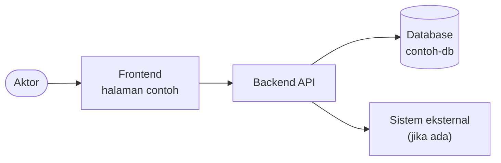
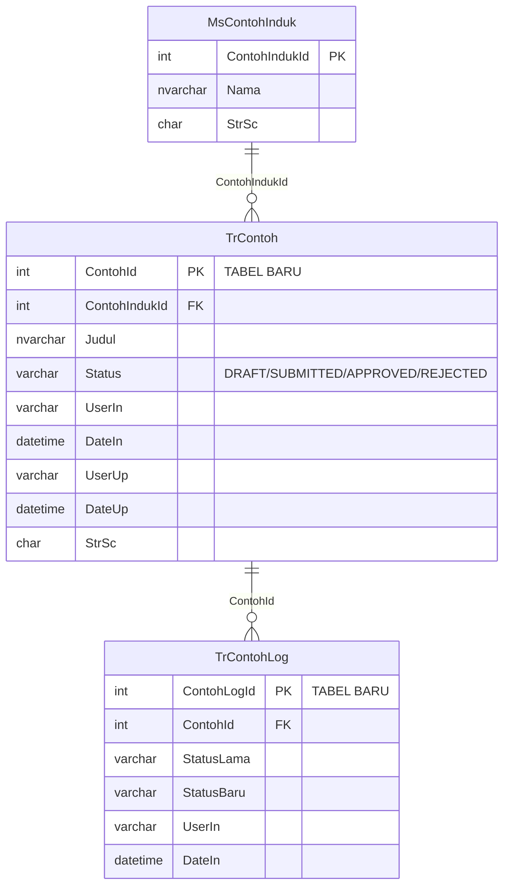
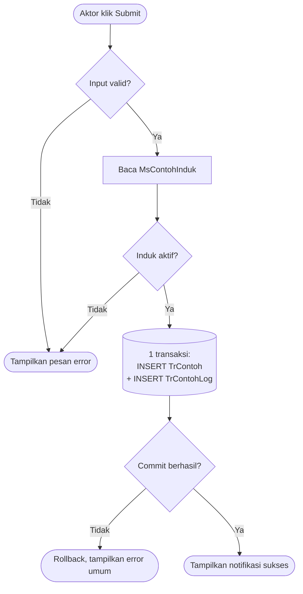
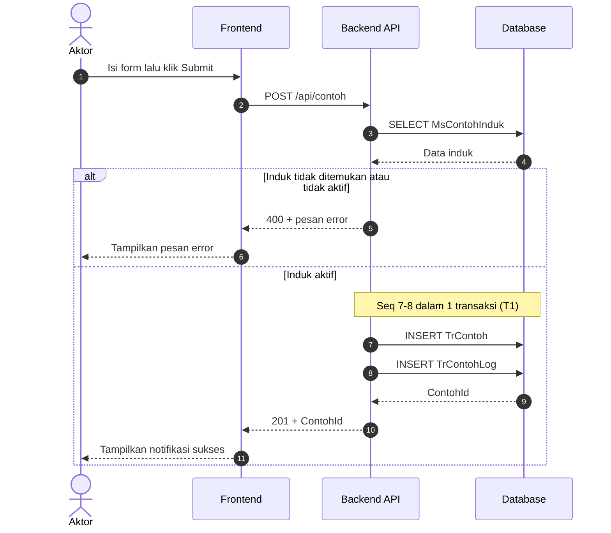
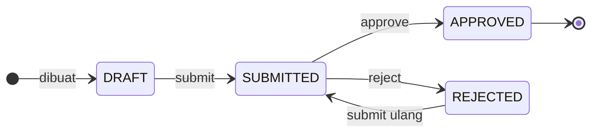

<!--
TEMPLATE DOKUMEN INTERNAL TIM IT
================================
Pembaca : System Analyst, Programmer, QA, DBA. Bukan untuk user/requester (itu porsi FRS).
Tujuan  : programmer bisa mulai coding dari dokumen ini tanpa bertanya ulang, terutama soal
          tabel apa yang dibaca/ditulis, kolom apa, kondisinya apa, dan dalam transaksi yang mana.

Cara pakai:
1. Ganti semua {{placeholder}}. Cari "{{" untuk memastikan tidak ada yang tertinggal.
2. Semua isi bertanda "contoh" (tabel TrContoh, MsContohInduk, dst.) hanya ilustrasi tingkat
   detail yang diharapkan. Timpa dengan isi sebenarnya.
3. Blok "Flow N" boleh diulang sebanyak jumlah flow/proses. Salin 1 blok utuh, jangan dipotong.
4. Section yang tidak relevan tetap ditulis dengan isi "Tidak ada" + 1 kalimat alasannya,
   supaya pembaca tahu itu sudah dipertimbangkan, bukan terlupa.
5. Komentar HTML seperti ini tidak tampil di viewer. Hapus setelah dokumen terisi.
6. Bagian 3 (Bahan FRS) dipakai AI agent untuk membuat md FRS setelah dokumen final.
   Nama heading di Bagian 1-3 jangan diganti; instruksi konversi merujuk ke nama-nama itu.

Aturan agar flow CRUD jelas:
- Sequence diagram memakai "autonumber". Nomor panah = kolom "Seq" di tabel CRUD di bawahnya.
- Setiap panah API->>DB WAJIB punya 1 baris di tabel CRUD. Tidak boleh ada akses DB yang
  hanya muncul di diagram atau hanya muncul di tabel.
- Sebut nama tabel dan kolom apa adanya (backtick), bukan istilah bisnisnya.
- Tulis kondisi WHERE / key yang dipakai, bukan sekadar "ambil data X".
- Hal yang belum pasti ditulis apa adanya ("belum diverifikasi ke DDL"), jangan ditebak.
-->

# {{Nama Fitur / Modul}} - {{Nama Aplikasi}}

{{Satu paragraf konteks: masalah yang terjadi, siapa yang terdampak, dan solusi yang diusulkan. Tulis sebagai narasi, bukan poin-poin — ini yang dibaca orang yang baru pertama kali membuka dokumen.}}

---

# Bagian 1 — Analisa & Alasan Desain

<!-- Bagian 1 menjawab "kenapa dibuat seperti ini". Bagian 2 menjawab "bagaimana persisnya". -->

## Temuan

<!-- Fakta dari kode/DB/infrastruktur yang memengaruhi desain. Sertakan angka (jumlah row, durasi) bila ada. -->

| # | Temuan | Dampak |
|---|--------|--------|
| 1 | {{Fakta yang ditemukan, sebut nama tabel/file/method-nya}} | {{Akibatnya terhadap desain}} |
| 2 | {{...}} | {{...}} |

## Keputusan Desain & Alasannya

<!-- Nomor D1, D2, ... dirujuk dari Bagian 2 (mis. "lihat D3"). Jangan dinomori ulang setelah dirujuk. -->

| # | Keputusan | Alasan | Alternatif yang Tidak Dipilih |
|---|-----------|--------|-------------------------------|
| D1 | {{Apa yang diputuskan}} | {{Kenapa; rujuk nomor temuan bila relevan}} | {{Opsi lain dan kenapa ditolak, atau —}} |
| D2 | {{...}} | {{...}} | {{...}} |

## Perlu Didiskusikan

<!-- Hal yang BELUM diputuskan dan butuh jawaban orang lain. Sebut siapa yang perlu menjawab. -->

- **{{Topik}}** — {{pertanyaannya, dampaknya ke desain, dan siapa yang perlu mengonfirmasi}}. **Belum ditetapkan.**

## Rekomendasi (Belum Masuk Scope)

- **{{Nama rekomendasi}}** *({{recommended / fase 2}})* — {{manfaatnya dan kenapa belum masuk scope}}.

---

# Bagian 2 — Flow Final

## Gambaran Besar

{{2–3 kalimat: komponen apa saja yang terlibat dan bagaimana data mengalir di antaranya.}}

| | {{Flow 1}} | {{Flow 2}} |
|---|---|---|
| Aktor / pemicu | {{Role, atau scheduler + jadwalnya}} | {{...}} |
| Entry point | {{Halaman / endpoint / nama job}} | {{...}} |
| Baca dari | {{Tabel}} | {{...}} |
| Tulis ke | {{Tabel}} | {{...}} |
| Sistem eksternal | {{API / SMTP / SSO, atau —}} | {{...}} |



## Aktor & Hak Akses

| Role | Boleh | Tidak boleh |
|------|-------|-------------|
| {{Role}} | {{Aksi yang diizinkan}} | {{Aksi yang ditolak dan respons-nya, mis. 403}} |

## DMD

{{1–2 kalimat: berapa tabel yang terlibat, di database mana, mana yang baru dan mana yang diubah.}}

### Tabel yang Terlibat

<!-- Status: Existing / Existing (tambah index) / Diubah / Baru. -->

| Tabel | Database | Status | Peran |
|-------|----------|--------|-------|
| `MsContohInduk` | {{contoh-db}} | Existing | {{contoh — master yang divalidasi sebelum simpan}} |
| `TrContoh` | {{contoh-db}} | **Baru** | {{contoh — 1 baris per pengajuan}} |
| `TrContohLog` | {{contoh-db}} | **Baru** | {{contoh — riwayat perubahan status}} |

### Entity Relationship Diagram

<!-- Cukup tabel yang dipakai flow di dokumen ini. Tandai "TABEL BARU" / "KOLOM BARU" di komentar atribut.
     Relasi tanpa FK constraint di DB: tulis di catatan bawah diagram sebagai relasi logis. -->



**Catatan relasi:**

1. {{Relasi mana yang FK constraint asli, mana yang hanya join di aplikasi.}}
2. {{Hal yang belum diverifikasi ke DDL.}}

### Kamus Data — Tabel Baru / Diubah

<!-- 1 tabel per sub-tabel. Hanya untuk tabel Baru/Diubah; tabel existing cukup di ERD. -->

**`TrContoh`** (baru)

| Kolom | Tipe | Null | Default | Keterangan |
|-------|------|------|---------|------------|
| `ContohId` | `int IDENTITY` | No | — | PK |
| `ContohIndukId` | `int` | No | — | FK ke `MsContohInduk` |
| `Status` | `varchar(20)` | No | `'DRAFT'` | Lihat *Siklus Status* |
| `UserIn` / `DateIn` | `varchar(50)` / `datetime` | No | — / `GETDATE()` | Audit insert |
| `UserUp` / `DateUp` | `varchar(50)` / `datetime` | Yes | — | Audit update |
| `StrSc` | `char(1)` | No | `'A'` | `A` aktif, `D` soft delete |

### Prasyarat

<!-- DDL yang harus sudah jalan sebelum kode di-deploy. Sebut siapa yang perlu approve. -->

1. **{{Tabel baru / kolom baru / index}}** — {{perlu approval DBA? ya/tidak}}:

    ```sql
    -- {{DDL}}
    ```

2. **{{Data awal / seed / permission}}** — {{...}}

### Matriks CRUD

Ringkasan tabel mana disentuh flow mana. Detail per langkah ada di tiap *Flow → CRUD / Akses Data*.

**Notasi:** `C` = INSERT, `R` = SELECT, `U` = UPDATE, `D` = DELETE fisik. Soft delete ditulis `U`, dengan kolom penandanya disebut di tabel detail.

| Tabel | {{Flow 1}} | {{Flow 2}} | {{Flow 3}} |
|-------|:---:|:---:|:---:|
| `MsContohInduk` | R | R | — |
| `TrContoh` | C | R, U | R |
| `TrContohLog` | C | C | R |

## Konfigurasi

<!-- Nilai yang bisa berubah tanpa ubah kode. Hapus section ini jika memang tidak ada config baru. -->

```json
"{{NamaFitur}}": {
  "Enabled": true
}
```

| Environment | {{Key}} | Catatan |
|-------------|---------|---------|
| Development | {{nilai}} | {{...}} |
| Staging | {{nilai}} | {{...}} |
| Production | {{nilai}} | {{...}} |

<!-- ===================== BLOK FLOW — ULANGI PER FLOW ===================== -->

## Flow 1 — {{Nama Flow}}

| | |
|---|---|
| **Tujuan** | {{Apa yang dicapai flow ini, 1 kalimat}} |
| **Aktor** | {{Role / scheduler}} |
| **Pemicu** | {{Klik tombol X di halaman Y / cron `...`}} |
| **Entry point** | {{`POST /api/...` / `NamaController.Action` / `NamaJob`}} |
| **Prasyarat** | {{Kondisi yang harus sudah terpenuhi, mis. sudah login sebagai role X}} |
| **Hasil akhir** | {{Kondisi data setelah flow sukses}} |

### Activity Diagram

<!-- Sudut pandang proses: keputusan dan cabang. Operasi DB yang 1 transaksi digambar sebagai 1 node silinder.
     Diagram ini teknis dan tetap flowchart Mermaid. Swimlane sesuai standar FRS (lane per aktor, Start/End,
     Yes/No) dibuat saat konversi ke FRS, dari diagram ini + baris Aktor di tabel atas. -->



### Sequence Diagram

<!-- Sudut pandang siapa-memanggil-siapa. WAJIB autonumber: nomor panah dipakai di tabel CRUD. -->



### CRUD / Akses Data

<!-- Inti dokumen ini. 1 baris per akses DB (atau per panggilan sistem eksternal).
     Seq       : nomor panah di sequence diagram.
     Operasi   : C / R / U / D (lihat notasi di Matriks CRUD).
     Kolom     : kolom yang dibaca (R) atau nilai yang ditulis (C/U) — tulis nilainya, mis. `Status = 'SUBMITTED'`.
     Kondisi   : WHERE / key yang dipakai. Untuk C tulis "—".
     Transaksi : T1, T2, ... untuk operasi yang harus commit/rollback bersama. "—" jika berdiri sendiri. -->

| Seq | Aktivitas | Tabel | Operasi | Kolom yang dibaca / diubah | Kondisi (WHERE / key) | Transaksi | Catatan |
|-----|-----------|-------|:-------:|----------------------------|-----------------------|:---------:|---------|
| 3 | Validasi induk | `MsContohInduk` | R | `ContohIndukId`, `Nama` | `ContohIndukId = @ContohIndukId AND StrSc = 'A'` | — | Tidak ada baris → 400. |
| 7 | Simpan pengajuan | `TrContoh` | C | `ContohIndukId`, `Judul`, `Status = 'SUBMITTED'`, `UserIn`, `DateIn = GETDATE()`, `StrSc = 'A'` | — | T1 | `ContohId` dari `SCOPE_IDENTITY()`. |
| 8 | Catat riwayat status | `TrContohLog` | C | `ContohId`, `StatusLama = NULL`, `StatusBaru = 'SUBMITTED'`, `UserIn`, `DateIn` | — | T1 | Gagal → T1 rollback, tidak ada `TrContoh` tanpa log. |

### Query

<!-- Tulis SQL sebenarnya untuk operasi yang tidak sepele: join, filter kompleks, update bersyarat, locking.
     INSERT/UPDATE 1 tabel yang sudah jelas dari tabel CRUD tidak perlu ditulis ulang. -->

```sql
-- Seq 3
SELECT ContohIndukId, Nama
FROM MsContohInduk
WHERE ContohIndukId = @ContohIndukId
  AND StrSc = 'A';
```

- `@ContohIndukId` = {{asal nilainya, mis. dari body request}}.

### Validasi & Aturan Bisnis

<!-- Urut sesuai urutan pengecekan di kode. Sebut di mana dicek (FE / API / constraint DB) dan respons saat gagal. -->

| # | Aturan | Dicek di | Jika gagal |
|---|--------|----------|------------|
| 1 | {{mis. `Judul` wajib, maks. 200 karakter}} | FE + API | {{400, pesan: "..."}} |
| 2 | {{mis. 1 user hanya boleh punya 1 pengajuan `SUBMITTED` per induk}} | API + unique index | {{409, pesan: "..."}} |

### Transaksi & Konkurensi

- **Batas transaksi:** {{T1 mencakup Seq berapa saja; apa yang terjadi saat rollback.}}
- **Idempotensi:** {{bagaimana request ganda / double click / retry tidak menghasilkan data dobel — unique constraint, pengecekan status, dll.}}
- **Konkurensi:** {{apa yang terjadi jika 2 user/instance memproses baris yang sama; locking hint atau optimistic check yang dipakai.}}
- **Sistem eksternal:** {{panggilan API/SMTP dilakukan di dalam atau di luar transaksi DB, dan alasannya.}}

### Alur Alternatif & Kegagalan

| Kondisi | Yang terjadi | Kondisi data setelahnya |
|---------|--------------|-------------------------|
| {{mis. induk tidak aktif}} | {{API 400, FE menampilkan pesan}} | {{Tidak ada perubahan data}} |
| {{mis. DB timeout saat T1}} | {{Rollback, API 500, FE menampilkan error umum}} | {{Tidak ada baris tersimpan}} |
| {{mis. sistem eksternal down}} | {{...}} | {{...}} |

<!-- =================== AKHIR BLOK FLOW — SALIN UNTUK FLOW 2, 3, ... =================== -->

## Siklus Status

<!-- 1 diagram + 1 tabel per kolom status. Hapus section ini jika tidak ada kolom status. -->



**`TrContoh.Status`**

| Dari | Ke | Kapan | Oleh |
|------|----|-------|------|
| — | `DRAFT` | {{...}} | {{Flow / role}} |
| `DRAFT` | `SUBMITTED` | {{...}} | {{...}} |
| `SUBMITTED` | `APPROVED` / `REJECTED` | {{...}} | {{...}} |

## Kontrak API

<!-- 1 sub-section per endpoint baru/berubah. Hapus section ini jika tidak ada perubahan API. -->

### `{{METHOD}} {{/path}}`

| | |
|---|---|
| **Auth** | {{Role / policy}} |
| **Dipakai oleh** | {{Flow N, Seq n}} |

**Request**

```json
{
  "contohIndukId": 1,
  "judul": "string"
}
```

**Response**

| Status | Kapan | Body |
|--------|-------|------|
| 201 | Sukses | `{ "contohId": 123 }` |
| 400 | Validasi gagal | `{ "message": "..." }` |
| 403 | Role tidak berhak | — |

## Penyesuaian di Aplikasi

<!-- Perubahan di luar flow utama: halaman, menu, komponen, struktur file. 1 sub-section per perubahan. -->

### 1. {{Nama halaman / komponen}}

- **Lokasi:** {{`path/ke/file`}}
- **Sebelum:** {{perilaku sekarang}}
- **Sesudah:** {{perilaku baru}}

## Rencana Deploy & Testing

### Urutan Deploy

1. {{DDL / index (butuh approval DBA)}}
2. {{Config per environment}}
3. {{Deploy backend, lalu frontend}}
4. {{Langkah verifikasi setelah deploy}}

**Rollback:** {{cara membatalkan, dan apakah DDL ikut dibatalkan.}}

### Checklist Pengujian

<!-- Minimal: 1 skenario sukses per flow, tiap baris di "Alur Alternatif & Kegagalan", dan tiap transisi status. -->

| # | Skenario | Langkah | Hasil yang diharapkan (termasuk kondisi data di DB) |
|---|----------|---------|------------------------------------------------------|
| 1 | {{Flow 1 sukses}} | {{...}} | {{1 baris `TrContoh` berstatus `SUBMITTED` + 1 baris `TrContohLog`}} |
| 2 | {{Flow 1 — induk tidak aktif}} | {{...}} | {{400, tidak ada baris baru}} |

---

# Bagian 3 — Bahan FRS

<!--
Bagian ini HANYA berisi hal yang dibutuhkan FRS tetapi tidak bisa diturunkan dari Bagian 1 & 2.
Saat dokumen sudah final, AI agent mengubah dokumen ini menjadi md FRS dengan mengikuti
"konversi-internal-ke-frs.md". Yang tidak tertulis di sini akan muncul di FRS sebagai
{{PERLU DIISI: ...}}, bukan dikarang.

Yang TIDAK perlu ditulis ulang di sini karena diturunkan dari bagian lain:
- Objectives & Background  <- paragraf pembuka + Temuan
- User                     <- Aktor & Hak Akses
- Workflow                 <- Activity Diagram tiap flow
- Ringkasan 2.1            <- Gambaran Besar

Tulis bagian ini dengan bahasa user/bisnis: tanpa nama tabel, kolom, endpoint, atau istilah kode.
Kolom tabel di bawah sengaja sama persis dengan template FRS supaya bisa disalin apa adanya.
-->

## Identitas FRS

<!-- Nomor FRS dan Judul FRS wajib diisi: keduanya mengisi cover dan header dokumen Word.
     Running ID, Application ID, dan Hierarchy ID tidak ditulis di sini; diisi manual di Word. -->

| Field | Value |
|-------|-------|
| Nomor FRS | {{...}} |
| Judul FRS | {{...}} |
| Bahasa FRS | {{Indonesia / English}} |
| Application Name | {{...}} |

## Scope

{{Ringkasan cakupan pekerjaan dari sudut pandang user.}}

**Tidak termasuk:** {{hal yang sengaja di luar cakupan, atau N/A.}}

| No | Task | Impact | Modul | Expectation |
|----|------|--------|-------|-------------|
| 1 | {{Task 1}} | {{Dampaknya bagi user/proses bisnis}} | {{Modul yang terpengaruh}} | {{Hasil yang diharapkan user}} |

## Asumsi

1. {{Hal yang dianggap benar/tersedia dan perlu diketahui user, mis. data X sudah lengkap di sistem Y.}}

## Istilah

| No | Abbreviation | Description |
|----|--------------|-------------|
| 1 | {{Istilah / singkatan}} | {{Kepanjangan dan artinya}} |

## Halaman & Field

<!-- 1 blok per halaman/komponen per role = 1 blok 2.1.N di FRS, dengan urutan yang sama.
     Halaman yang sama dipakai 2 role dengan perilaku berbeda: buat 2 blok.
     Ini sisi user; perubahan teknis halaman (file, before/after) tetap di "Penyesuaian di Aplikasi". -->

### Halaman 1 — {{Nama Halaman}}

| Field | Value |
|-------|-------|
| Role | {{Role yang memakai halaman ini}} |
| Page Name | {{...}} |
| Component Name | {{...}} |
| New/Existing | {{New / Existing}} |
| Navigation | {{Menu > Sub Menu > Halaman}} |
| Flow terkait | {{Flow 1, Flow 2}} |

**Screen Layout**

<!-- Dibiarkan kosong: screenshot dimasukkan manual oleh SA di dokumen Word. Agent tidak membuat gambar.
     Hanya jika file gambarnya sudah disediakan SA, boleh ditulis di sini, mis.:
      -->

**Fields**

<!-- 1 baris per field/tombol/kolom yang tampil. Given = ditampilkan sistem, Input = diisi user. -->

| Fields | Details / Validation | Given / Input | Mandatory |
|--------|----------------------|---------------|-----------|
| {{Nama field}} | {{Perilaku, aturan validasi, dan pesan error dalam bahasa user}} | {{Given / Input}} | {{Yes / No}} |

## Kebutuhan Data

<!-- Jika tidak ada, tulis N/A dan hapus tabelnya. Berlaku juga untuk 2 section di bawah. -->

| No | Data | Source | Description |
|----|------|--------|-------------|
| 1 | {{Nama data}} | {{Aplikasi / pihak penyedia data}} | {{Kegunaannya di proses bisnis}} |

## Kebutuhan Laporan

| No | Report | Format | Filter / Parameter | Description |
|----|--------|--------|--------------------|-------------|
| 1 | {{Nama laporan}} | {{Excel / PDF / tampilan layar}} | {{Periode, status, dst.}} | {{Isi dan kegunaan laporan}} |

## Kebutuhan Interface

1. {{Permintaan khusus user soal tampilan, atau N/A.}}
